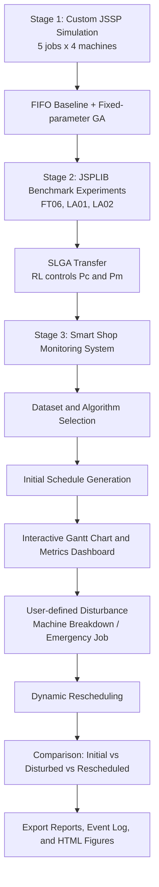
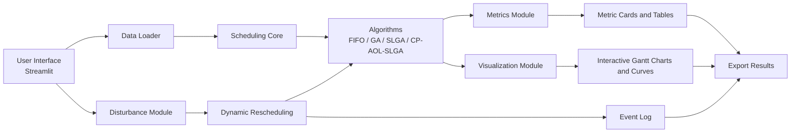
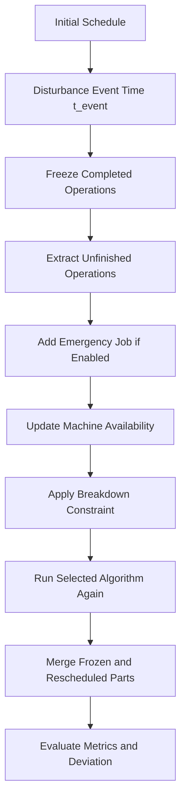

# Smart Shop Monitoring and Dynamic Rescheduling System

> Industrial 4.0 course project for intelligent job-shop scheduling, dynamic disturbance response, and interactive production monitoring.


## 1. Project Workflow



The final system upgrades the project from static algorithm experiments to an interactive Industrial 4.0 scheduling platform. Users can select benchmark datasets and scheduling algorithms, configure production disturbances, trigger rescheduling, and observe the effects through Gantt charts, metrics, learning curves, and event logs.

---

## 2. Project Overview

This repository implements a **Smart Shop Monitoring and Dynamic Rescheduling System** for the **Job Shop Scheduling Problem (JSSP)**. It is designed as the final stage of an Industrial 4.0 course project on scheduling and process optimization.

The system focuses on the following question:

> Given a set of jobs, machines, processing routes, and possible disturbances, how can an intelligent scheduling system generate, monitor, repair, and compare production schedules?

The final deliverable is not only a scheduling algorithm, but a local web-based monitoring system built with **Streamlit** and **Plotly**.

---

## 3. Project Evolution

### Stage 1: Custom JSSP Simulation

A small job-shop scenario was constructed manually:

- 5 jobs
- 4 machines
- 4 operations per job
- Objective: minimize makespan, also denoted as `Cmax`

The first stage compared:

- FIFO baseline scheduling
- Fixed-parameter Genetic Algorithm (GA)

It verified the basic scheduling pipeline:

```text
Data construction -> chromosome encoding -> schedule decoding -> GA optimization -> Gantt visualization -> metric comparison
```

### Stage 2: JSPLIB Benchmark + SLGA Transfer

The second stage introduced public benchmark data from **JSPLIB**, including:

| Instance |                Scale | Best Known Solution / Optimum | Purpose                                                  |
| -------- | -------------------: | ----------------------------: | -------------------------------------------------------- |
| FT06     |  6 jobs x 6 machines |                            55 | Small benchmark for validating algorithm quality         |
| LA01     | 10 jobs x 5 machines |                           666 | Medium-scale benchmark for showing improvement over FIFO |
| LA02     | 10 jobs x 5 machines |                           655 | Same scale as LA01 but different processing routes       |

The project then transferred the idea of **SLGA** from the paper:

> Chen et al., “A self-learning genetic algorithm based on reinforcement learning for flexible job-shop scheduling problem,” Computers & Industrial Engineering, 2020.

The original paper focuses on **FJSP**. In this project, the reinforcement-learning-based parameter control idea is adapted to **JSSP**. RL does not directly generate schedules. Instead, it learns how to adjust the GA parameters:

- `Pc`: crossover probability
- `Pm`: mutation probability

The second-stage experiments compared:

- FIFO
- Fixed-parameter GA
- SLGA with RL-controlled `Pc/Pm`

Summary of second-stage results:

| Instance | FIFO |  GA | SLGA | SLGA vs FIFO | SLGA vs GA | Gap to BKS |
| -------- | ---: | --: | ---: | -----------: | ---------: | ---------: |
| FT06     |   60 |  58 |   55 |        8.33% |      5.17% |      0.00% |
| LA01     |  858 | 672 |  669 |       22.03% |      0.45% |      0.45% |
| LA02     |  904 | 718 |  701 |       22.46% |      2.37% |      7.02% |

### Stage 3: Smart Shop Monitoring and Dynamic Rescheduling System

The final stage further upgrades the project into an interactive system. It supports:

- dataset selection
- algorithm selection
- initial schedule generation
- machine breakdown configuration
- emergency job insertion
- dynamic rescheduling
- comparison of initial, disturbed, and rescheduled plans
- export of reports and visualization files

This stage adds system-level and algorithm-level innovation, rather than only reproducing an existing paper or GitHub project.

---

## 4. System Architecture



Main modules:

| File                  | Function                                                          |
| --------------------- | ----------------------------------------------------------------- |
| `app.py`            | Streamlit web interface and system control flow                   |
| `data_loader.py`    | Dataset loading and parsing                                       |
| `scheduler_core.py` | Chromosome decoding and core scheduling logic                     |
| `algorithms.py`     | FIFO, GA, SLGA, and CP-AOL-SLGA implementations                   |
| `disturbance.py`    | Machine breakdown, emergency job, and dynamic rescheduling logic  |
| `metrics.py`        | Makespan, utilization, idle time, deviation, and other indicators |
| `visualization.py`  | Plotly Gantt charts, convergence curves, learning curves          |
| `video_export.py`   | Reserved module for future video or GIF export                    |

---

## 5. Supported Datasets

### 5.1 Custom 5x4 Dataset

The custom dataset contains 5 jobs and 4 machines. Each job has 4 operations:

```text
J1: M1,4 -> M2,3 -> M4,5 -> M3,2
J2: M2,2 -> M3,6 -> M1,3 -> M4,4
J3: M3,5 -> M1,4 -> M4,3 -> M2,6
J4: M4,3 -> M2,5 -> M3,4 -> M1,2
J5: M1,6 -> M4,2 -> M2,4 -> M3,3
```

### 5.2 JSPLIB Benchmark Instances

The project includes local benchmark files:

```text
data/ft06.txt
data/la01.txt
data/la02.txt
data/instances.json
```

Standard JSSP data are parsed into the common structure:

```python
jobs = [
    [(machine_id, processing_time), ...],
    ...
]
```

Machine indices in the raw data usually start from 0. In the web interface, they are displayed as `M1`, `M2`, `M3`, and so on.

---

## 6. Scheduling Algorithms

### 6.1 FIFO Baseline

FIFO is used as a simple benchmark. It repeatedly schedules jobs in a fixed order. It represents an experience-based dispatching rule without intelligent optimization.

### 6.2 Genetic Algorithm (GA)

The GA uses a repeated-job chromosome representation.

For example, if there are 5 jobs and each job has 4 operations, then each job ID appears 4 times and the chromosome length is 20.

```text
[0, 1, 2, 3, 4, 0, 1, 2, 3, 4, 0, 1, 2, 3, 4, 0, 1, 2, 3, 4]
```

The decoding rule is:

```text
The first occurrence of job 0 means J1-O1.
The second occurrence of job 0 means J1-O2.
The third occurrence of job 0 means J1-O3.
The fourth occurrence of job 0 means J1-O4.
```

This encoding naturally satisfies job precedence constraints.

GA operators include:

- tournament selection
- count-preserving crossover
- swap mutation
- elitism
- objective: minimize `Cmax`

### 6.3 SLGA: Self-Learning Genetic Algorithm

SLGA extends GA with reinforcement-learning-based parameter control.

State features include:

- current best makespan
- average makespan
- population diversity

Actions correspond to different `Pc/Pm` combinations.

Reward is based mainly on whether the current generation improves the best or average scheduling performance.

This design keeps GA as the search engine while using RL as an adaptive parameter controller.

### 6.4 CP-AOL-SLGA: Final-stage Improved Algorithm

The final stage introduces a course-project version of:

> **Critical Path enhanced Adaptive Operator Learning Self-Learning Genetic Algorithm**

Compared with SLGA, CP-AOL-SLGA expands the adaptive mechanism from only parameter selection to search-strategy selection.

The action space includes:

- high crossover and low mutation
- balanced crossover and mutation
- low crossover and high mutation
- swap mutation
- insertion mutation
- simplified bottleneck-machine local search

The simplified bottleneck local search works as follows:

1. Find the machine related to the latest finishing operation.
2. Treat it as the current bottleneck machine.
3. Try local changes around operations on this machine.
4. Accept the change if it improves makespan.

This makes the final algorithm a hybrid of global evolutionary search and local bottleneck refinement.

---

## 7. Disturbance and Dynamic Rescheduling

The web system supports two major disturbance types.

### 7.1 Machine Breakdown

Users can configure:

- whether to enable breakdown
- breakdown machine
- breakdown start time
- breakdown duration
- whether to trigger rescheduling

The breakdown interval is displayed as a red transparent area in the Gantt chart.

### 7.2 Emergency Job

Users can configure:

- insertion time
- new job route
- optional due date or priority information

Example route input:

```text
M1:4, M3:5, M2:3
```

The inserted job is merged with unfinished operations and included in the rescheduling process.

### 7.3 Dynamic Rescheduling Logic

The rescheduling process is event-driven:



Engineering simplification:

If an operation has started before `t_event` but has not finished, this version treats it as unfinished and sends it back to the rescheduling pool. This keeps the implementation clear for a course project. A future version can add non-interruptible processing or remaining-time continuation.

---

## 8. Evaluation Metrics

| Metric              | Meaning                                                 | Direction                  |
| ------------------- | ------------------------------------------------------- | -------------------------- |
| `Cmax` / Makespan | Total completion time of all jobs                       | Lower is better            |
| Average Utilization | Average machine utilization                             | Higher is better           |
| Total Idle Time     | Total idle time of all machines                         | Lower is better            |
| Finished Operations | Number of operations completed before event time        | Higher means more progress |
| Rescheduling Count  | Number of triggered rescheduling events                 | Scenario-dependent         |
| Schedule Deviation  | Sum of start-time changes between old and new schedules | Lower means more stable    |

The schedule deviation is defined as:

```text
Deviation = sum(abs(new_start_i - old_start_i))
```

This metric is important because a real factory does not only care about a shorter makespan. It also cares about schedule stability and execution feasibility.

---

## 9. Web Interface

The Streamlit interface contains:

- dataset selection
- algorithm selection
- disturbance configuration
- initial schedule generation button
- disturbance and rescheduling button
- metric cards
- three Gantt chart tabs:
  - Initial Schedule
  - Disturbed Schedule
  - Rescheduled Schedule
- algorithm monitoring area:
  - convergence curve
  - `Pc/Pm` learning trace
  - operator/action trace for CP-AOL-SLGA
- event log
- export button

---

## 10. Installation and Run

### 10.1 Install Dependencies

```bash
pip install -r requirements.txt
```

If `pip` points to a different Python environment, use:

```bash
python -m pip install -r requirements.txt
```

### 10.2 Start the Web System

```bash
streamlit run app.py
```

or:

```bash
python -m streamlit run app.py
```

Then open the local URL shown in the terminal, usually:

```text
http://localhost:8501
```

---

## 11. Output Files

After clicking `Export Results`, the system can generate:

```text
outputs/reports/schedule_results.csv
outputs/reports/metrics_results.csv
outputs/reports/event_log.txt
outputs/figures/initial_gantt.html
outputs/figures/rescheduled_gantt.html
```

Optional future output:

```text
outputs/videos/simulation_demo.mp4
```

---

## 12. Repository Structure

```text
smart_shop_scheduler/
├── app.py
├── scheduler_core.py
├── algorithms.py
├── disturbance.py
├── visualization.py
├── metrics.py
├── data_loader.py
├── video_export.py
├── requirements.txt
├── README.md
├── data/
│   ├── ft06.txt
│   ├── la01.txt
│   ├── la02.txt
│   └── instances.json
└── outputs/
    ├── reports/
    ├── figures/
    └── videos/
```

For GitHub deployment, `app.py` and `requirements.txt` should be placed in the repository root.

---

## 13. References and Acknowledgements

This project is built on the following academic and data references:

1. Chen et al., **“A self-learning genetic algorithm based on reinforcement learning for flexible job-shop scheduling problem,”** Computers & Industrial Engineering, 2020.
2. Reference implementation: `olgi9911/Self-Learning-GA-for-Flexible-Job-Shop-Scheduling-Problem`.
3. JSPLIB benchmark dataset: `tamy0612/JSPLIB`.
4. Benchmark instances used in this project: FT06, LA01, LA02.

Important distinction:

- The referenced paper and GitHub project focus on FJSP.
- This course project adapts the RL parameter-control idea to JSSP.
- The final-stage system further adds interactive monitoring, user-defined disturbances, dynamic rescheduling, schedule deviation, and a simplified CP-AOL-SLGA algorithm.

---

## 14. Final-stage Contributions

The final stage contributes the following improvements:

1. Upgrades static scheduling scripts into an interactive web-based monitoring system.
2. Supports user-defined machine breakdown and emergency job insertion.
3. Introduces event-driven dynamic rescheduling.
4. Freezes completed operations and optimizes unfinished tasks after disturbance.
5. Adds `Schedule Deviation` to evaluate schedule stability.
6. Supports multiple algorithms in one system: FIFO, GA, SLGA, CP-AOL-SLGA.
7. Uses interactive Gantt charts, metric cards, learning curves, and event logs to form an Industrial 4.0 scheduling loop.
8. Provides a deployable Streamlit application suitable for demonstration, recording, and course presentation.

---

## 15.A concise presentation description:

> This project develops a Smart Shop Monitoring and Dynamic Rescheduling System for Industrial 4.0. Based on previous GA and SLGA scheduling experiments, the final system provides a Streamlit-based web interface where users can select datasets, compare scheduling algorithms, configure machine breakdowns and emergency jobs, and trigger dynamic rescheduling. The system visualizes initial, disturbed, and rescheduled plans through interactive Gantt charts and evaluates the results using makespan, utilization, idle time, rescheduling count, and schedule deviation. It upgrades the project from static algorithm simulation to a closed-loop scheduling decision-support system.
