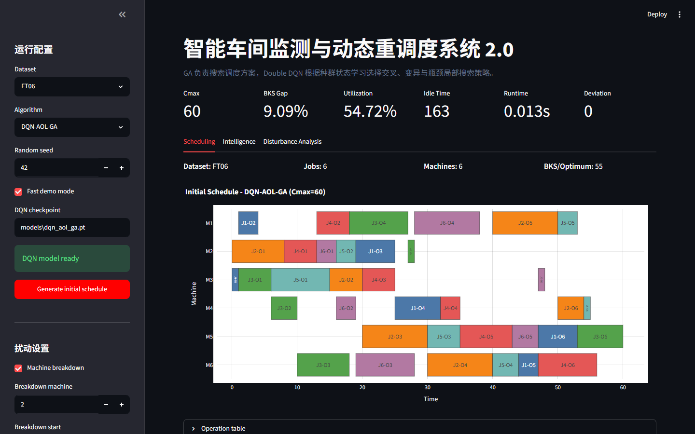
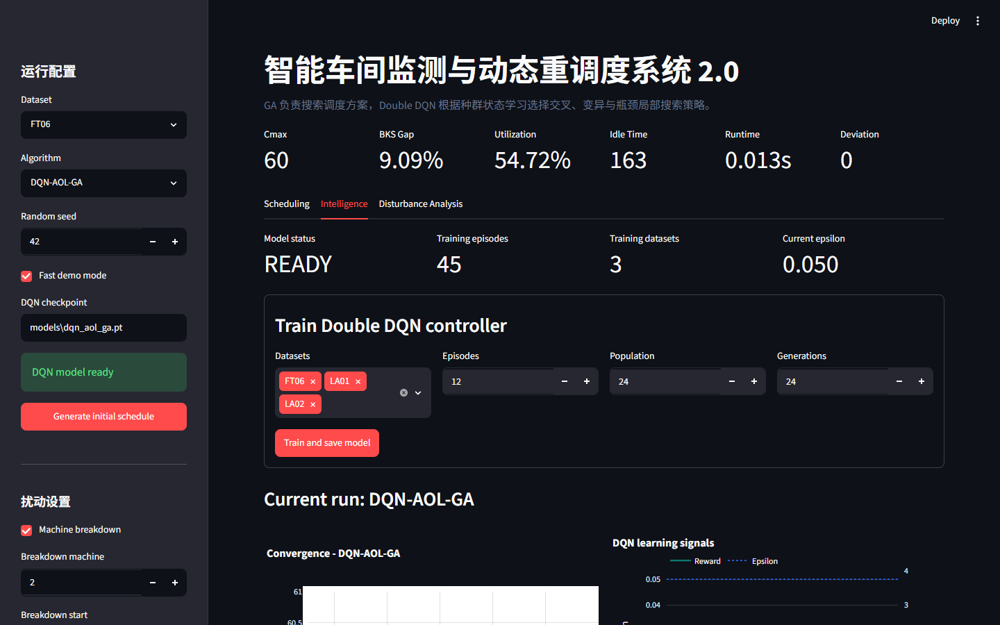
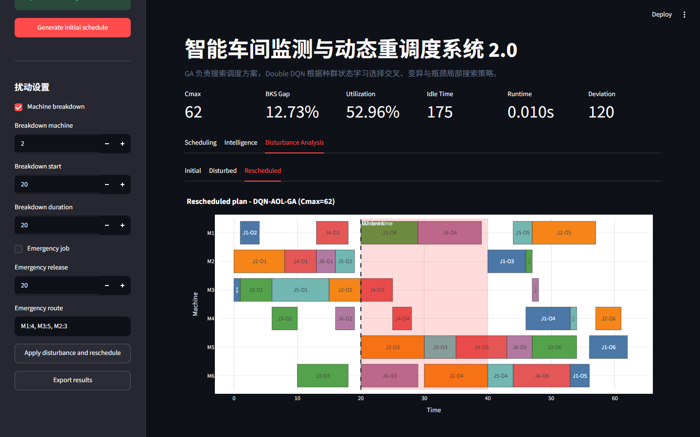
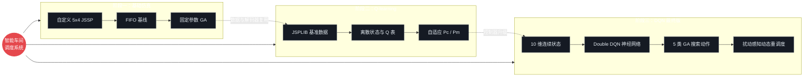
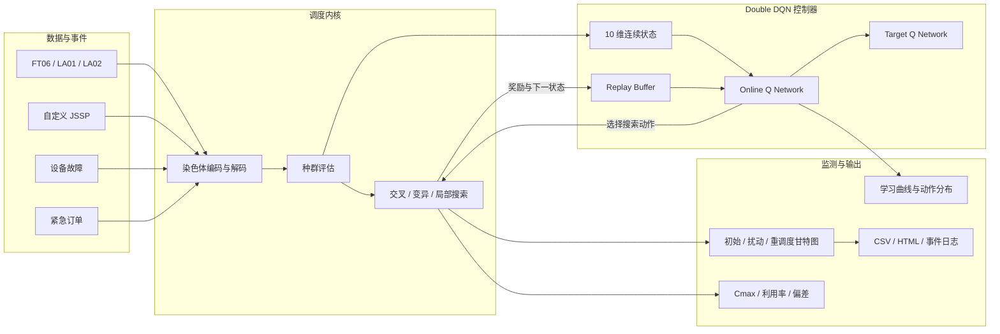
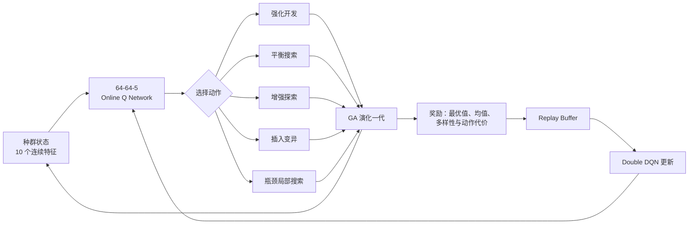

# 智能车间监测与动态重调度系统 2.0

> 基于遗传算法与 Double DQN 的作业车间调度、扰动响应和可视化仿真平台。


## 项目亮点

- 用神经网络拟合动作价值函数，完成从表格 Q-learning 到 Double DQN 的升级。
- DQN 不直接生成调度，而是根据种群状态选择 GA 的交叉、变异和瓶颈局部搜索策略。
- 支持 FT06、LA01、LA02 与自定义 5x4 JSSP 数据。
- 支持设备故障、紧急订单、已完成工序冻结和剩余工序动态重调度。
- 提供甘特图、奖励/损失/epsilon、动作分布、Q 值、事件日志和结果导出。
- 训练模型采用版本化 checkpoint，可继续训练、替换和复现实验。

## 系统界面

### 初始调度与甘特图



### DQN 训练与决策监测



### 设备故障后的动态重调度



## 项目演进



## 2.0 系统架构



## DQN-GA 决策闭环



状态特征覆盖最优/平均适应度、种群离散度、停滞程度、迭代进度、剩余工序比例、机器负载离散度、故障压力和紧急订单标记。Double DQN 使用在线网络选择下一动作、目标网络评估该动作，降低 Q 值过估计。

## 实验结果

实验配置：三个 JSPLIB 实例、5 个随机种子（11/22/33/44/55）、种群规模 60、迭代 100。除 FIFO 外，所有算法使用相同搜索预算。表中为 `平均 Cmax ± 标准差`，越低越好。

| 算法 | FT06 | LA01 | LA02 |
| --- | ---: | ---: | ---: |
| FIFO | 60.00 ± 0.00 | 858.00 ± 0.00 | 904.00 ± 0.00 |
| GA | 58.20 ± 0.75 | 746.40 ± 33.58 | 767.20 ± 28.73 |
| SLGA（表格 Q-learning） | 57.80 ± 0.98 | 730.20 ± 14.63 | **739.80 ± 16.10** |
| CP-AOL-SLGA | 57.80 ± 0.75 | 748.00 ± 19.18 | 749.00 ± 15.01 |
| **DQN-AOL-GA** | **57.00 ± 1.67** | **721.00 ± 16.99** | 754.40 ± 21.36 |

| 数据集 | BKS | DQN 最优值 | DQN 平均 Gap | DQN 平均运行时间 |
| --- | ---: | ---: | ---: | ---: |
| FT06 | 55 | **55** | 3.64% | 0.2362 s |
| LA01 | 666 | 700 | 8.26% | 0.3044 s |
| LA02 | 655 | 734 | 15.18% | 0.3044 s |

结果说明：DQN-AOL-GA 在 FT06 和 LA01 的平均 Cmax 最低；LA02 上 SLGA 更稳定，说明当前训练数据量和网络规模仍有提升空间。三个数据集的平均归一化 Gap 为 9.03%，略低于 SLGA 的 9.23%。完整原始数据见 [`outputs/experiments/static_raw.csv`](outputs/experiments/static_raw.csv) 与 [`static_summary.csv`](outputs/experiments/static_summary.csv)。

### 动态故障验证

FT06、seed=42、M2 在 `t=20~40` 停机：

| 指标 | 结果 |
| --- | ---: |
| 初始计划 Cmax | 60 |
| 仅施加故障、不优化 Cmax | 74 |
| DQN 动态重调度 Cmax | **62** |
| 相对未优化方案降低 | **16.22%** |
| 调度偏差 | 120 |

## 快速开始

```powershell
git clone https://github.com/FG696-969/smart_shop_scheduler.git
cd smart_shop_scheduler
python -m venv .venv
.\.venv\Scripts\Activate.ps1
python -m pip install -r requirements.txt
```

首次运行 DQN 前先训练模型：

```powershell
python -m training.train_dqn `
  --datasets FT06 LA01 LA02 `
  --episodes 45 `
  --checkpoint models\dqn_aol_ga.pt `
  --base-seed 84
```

启动系统：

```powershell
streamlit run app.py
```

浏览器打开 `http://localhost:8501`。若只想快速验证训练链路，可在训练命令末尾增加 `--fast`。

## 复现实验

```powershell
python -m experiments.benchmark `
  --checkpoint models\dqn_aol_ga.pt `
  --datasets FT06 LA01 LA02 `
  --seeds 11 22 33 44 55 `
  --population 60 `
  --generations 100 `
  --output-dir outputs\experiments
```

## 目录结构

```text
smart_shop_scheduler2.0/
├─ algorithms/          # FIFO、GA、SLGA、DQN-AOL-GA
├─ rl/                  # 状态、动作、Replay Buffer、Double DQN、checkpoint
├─ services/            # 训练与调度服务
├─ training/            # DQN 命令行训练入口
├─ experiments/         # 可复现实验脚本
├─ data/                # JSSP 数据集
├─ docs/assets/         # README 页面截图
├─ outputs/experiments/ # 实验原始数据与汇总表
├─ tests/               # 单元、集成、动态重调度与 UI 测试
└─ app.py               # Streamlit 入口
```

## Q-learning 与 DQN 的区别

| 项目 | SLGA | DQN-AOL-GA |
| --- | --- | --- |
| Q 函数 | 10 状态的离散 Q 表 | 神经网络拟合连续状态 Q 值 |
| 状态表达 | 最优值、均值和多样性离散化 | 10 维连续种群/扰动特征 |
| 动作 | 调整交叉率和变异率 | 5 类搜索策略，包括局部搜索 |
| 经验利用 | 当前 episode 在线更新 | Replay Buffer 随机采样 |
| 稳定机制 | 无目标网络 | Online/Target 双网络 |
| 模型保存 | Q 表未持久化 | 版本化 PyTorch checkpoint |

## 测试

```powershell
python -m pip install -r requirements-dev.txt
python -m pytest -q
```

当前测试覆盖状态编码、动作空间、Replay Buffer、Double DQN 更新、checkpoint 恢复、静态/动态调度、训练服务、实验汇总和 Streamlit 页面冒烟测试。

## 后续改进

- 扩充训练实例与 episode 数量，重点提升 LA02 泛化稳定性。
- 加入 Prioritized Experience Replay、Dueling DQN 或 n-step return。
- 引入更多动态事件、交期与总拖期目标，扩展为多目标调度。
- 在更大规模 JSPLIB 实例上进行显著性检验与消融实验。
